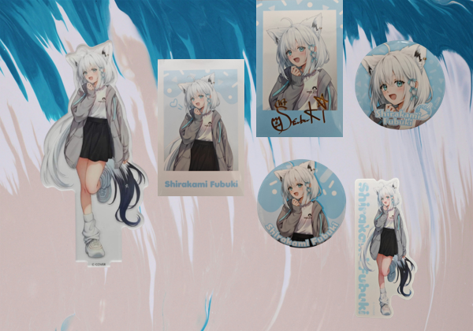

# Interactive Genetic Algorithm Based Ita Bag Layout Generator



An Interactive Genetic Algorithm (IGA) based layout generation system for ita-bag design.

This project explores how evolutionary computation and user preference evaluation can be combined to generate aesthetically pleasing ita-bag layouts using interactive evolution.

---

# Project Overview

This system generates ita-bag layouts by combining:

- Interactive Genetic Algorithm (IGA)
- Automatic aesthetic evaluation
- User preference scoring
- Background recommendation via color analysis
- Constraint-based object placement

The goal of the project is to investigate how interactive evolutionary systems can assist users in creating visually balanced and personalized ita-bag layouts.

---

# Features

## Interactive Evolutionary Layout Generation

- Multi-generation evolutionary process
- User-guided selection
- Hybrid fitness evaluation
- Interactive GUI scoring

---

## Constraint-Based Placement

The system supports:

- Non-overlapping placement
- Grid-aligned placement
- Boundary constraints
- Layout repair strategies

---

## Automatic Aesthetic Evaluation

The system evaluates layouts using four aesthetic principles:

1. Proximity
2. White Space
3. Alignment
4. Contrast

An overlap penalty is also applied to reduce invalid layouts.

---

## Background Recommendation

Background images are selected using precomputed color similarity analysis.

The workflow is:

1. Analyze dominant colors of object combinations
2. Compute color distances to backgrounds
3. Rank candidate backgrounds
4. Recommend top-K backgrounds

---

## Experiment Management

The system automatically records:

- generation outputs
- layout scores
- best layouts
- fitness trends
- background usage
- experiment summaries

Each run is archived independently.

---

# System Workflow

```text
Object List
    ↓
Background Analysis
    ↓
Initial Layout Generation
    ↓
User Evaluation
    ↓
Automatic Aesthetic Scoring
    ↓
Hybrid Fitness Calculation
    ↓
Selection / Crossover / Mutation
    ↓
Next Generation
```

---

# Project Structure

```text
Interactive Genetic Algorithm Based Ita Bag Layout Generator/
│
├── README.md
├── requirements.txt
├── .gitignore
├── config.json
│
├── iga_main.py
├── analyze_backgrounds.py
├── layout_utils.py
├── evolution.py
├── aesthetic_score.py
├── render_utils.py
│
├── object_lists/
├── bg_analysis/
├── src/
├── background/
├── results/
├── output/
├── examples/
└── docs/
```

---

# Main Modules

## iga_main.py

Main GUI application.

Responsible for:

- layout browsing
- user interaction
- background switching
- generation control
- experiment management

---

## analyze_backgrounds.py

Background recommendation preprocessing.

Responsible for:

- object color analysis
- background color analysis
- color distance ranking
- exporting bg_analysis JSON

---

## layout_utils.py

Layout generation and repair logic.

Responsible for:

- non-overlapping placement
- grid snapping
- layout adjustment
- layout repair

---

## evolution.py

Evolutionary operators.

Responsible for:

- parent selection
- crossover
- mutation
- next generation creation

---

## aesthetic_score.py

Automatic aesthetic evaluation.

Implements:

- proximity score
- white space score
- alignment score
- contrast score
- overlap penalty

---

## render_utils.py

Rendering utilities.

Responsible for:

- layout rendering
- PNG export

---

# Installation

## Requirements

- Python 3.10+
- Pillow

Install dependencies:

```bash
pip install -r requirements.txt
```

---

# Usage

## Step 1 — Prepare object images

Place object images inside:

```text
src/
```

Example:

```text
src/
├── badge_001.png
├── badge_002.png
├── acrylstand_001.png
└── ...
```

---

## Step 2 — Prepare backgrounds

Place background images inside:

```text
background/
```

---

## Step 3 — Create an object list

Example:

```json
[
  {
    "filename": "badge_001.png",
    "w": 116,
    "h": 116
  },
  {
    "filename": "acrylstand_001.png",
    "w": 140,
    "h": 290
  }
]
```

Save it in:

```text
object_lists/
```

---

## Step 4 — Analyze backgrounds

Run:

```bash
python analyze_backgrounds.py
```

This generates:

```text
bg_analysis/
```

---

## Step 5 — Run the IGA system

Run:

```bash
python iga_main.py
```

---

# GUI Functions

The GUI supports:

- layout browsing
- background switching
- user scoring
- generation submission
- best result preview
- PNG export
- experiment switching

---

# Hybrid Fitness

Final fitness combines:

## User Score

- Bad = 1
- Normal = 3
- Good = 5

## Automatic Aesthetic Score

Based on:

- proximity
- white space
- alignment
- contrast
- overlap penalty

Final fitness is computed as a weighted combination of:

```text
Final Fitness =
(User Weight × User Score)
+
(Auto Weight × Aesthetic Score)
```

---

# Experiment Output

Each experiment run generates:

```text
results/run_xxx/
```

Including:

- generation JSON
- best layout PNG
- best layout JSON
- score history
- background usage
- run summary

---

# Example Outputs

You can place demonstration images inside:

```text
examples/
```

Example:

```text
examples/
├── gui_screenshot.png
├── best_layout_example.png
└── generation_example.png
```

---

# Future Work

Potential future improvements include:

- adaptive preference learning
- stronger layout repair strategies
- ML-based aesthetic prediction
- automatic visual analytics
- multi-user preference modeling
- dynamic object scaling
- semantic layout grouping

---

# Research Context

This project was developed as part of an Interactive Genetic Algorithm based ita-bag layout generation research project.

The system investigates how evolutionary computation and human preference evaluation can be combined to support creative visual layout design.

---

# License

No license has been added yet.

---

# Note:
Image assets are omitted from the repository due to copyright considerations.

Users may place their own images inside the src/ and background/ folders.
